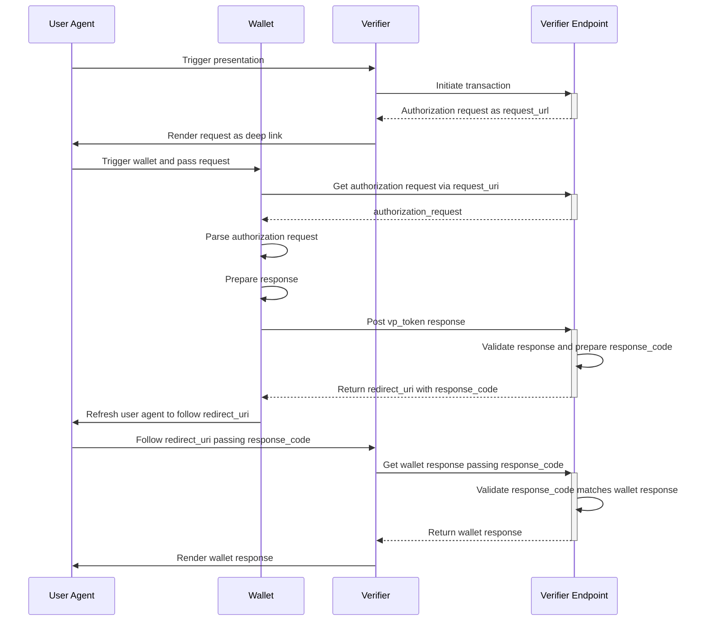
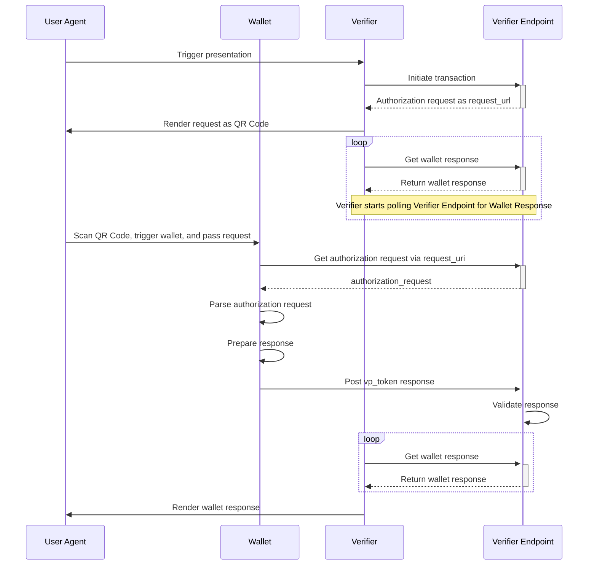

The EUDI Verifier Endpoint supports two primary presentation flows for credential verification: **same-device** and **cross-device** flows. These flows define how the wallet interacts with the verifier to present credentials.

## Overview

Both flows follow the [OpenID4VP 1.0](https://openid.net/specs/openid-4-verifiable-presentations-1_0-final.html) protocol and involve:

- **Authorization Request**: Created by the verifier containing what credentials are requested
- **Wallet Response**: Submitted by the wallet containing the requested credentials
- **Response Retrieval**: The verifier obtains the wallet's response

The key difference between the flows is how the authorization request reaches the wallet and how response retrieval is coordinated.

## Same-Device Flow

In the same-device flow, the user's wallet and the verifier UI are on the same device. The wallet is triggered via a deep link, and after posting its response, redirects the user back to the verifier UI.



### Key Characteristics

- **Deep Link**: The authorization request is rendered as a clickable link that launches the wallet
- **Response Code**: A unique code is generated to correlate the wallet response with the transaction
- **Redirect URI**: After posting the response, the wallet redirects back to the verifier UI with the response code
- **Synchronous**: The user sees immediate feedback as they're redirected back to the verifier

### Implementation Details

When initializing a same-device transaction, provide a `wallet_response_redirect_uri_template`:

```bash
curl -X POST http://localhost:8080/ui/presentations \
  -H "Content-Type: application/json" \
  -d '{
    "dcql_query": { ... },
    "nonce": "unique-nonce",
    "jar_mode": "by_reference",
    "wallet_response_redirect_uri_template": "https://verifier.example.com/callback?response_code={RESPONSE_CODE}"
  }'
```

See [InitTransaction.kt:88-99](/home/daytona/workspace/source/src/main/kotlin/eu/europa/ec/eudi/verifier/endpoint/port/input/InitTransaction.kt#L88-L99) for the request structure.

## Cross-Device Flow

In the cross-device flow, the wallet is on a different device than the verifier UI. The authorization request is presented as a QR code, and the verifier polls for the wallet response.



### Key Characteristics

- **QR Code**: The authorization request is rendered as a scannable QR code
- **No Response Code**: The verifier polls for the response without a redirect mechanism
- **Polling**: The verifier repeatedly queries the endpoint until the wallet submits a response
- **Asynchronous**: The wallet and verifier operate independently

### Implementation Details

For a cross-device flow, request a QR code output and omit the redirect URI template:

```bash
curl -X POST http://localhost:8080/ui/presentations \
  -H "Content-Type: application/json" \
  -H "Accept: image/png" \
  -d '{
    "dcql_query": { ... },
    "nonce": "unique-nonce",
    "jar_mode": "by_reference"
  }'
```

The verifier then polls using the transaction ID:

```bash
curl http://localhost:8080/ui/presentations/{transaction_id}
```

See [GetWalletResponse.kt:91-96](/home/daytona/workspace/source/src/main/kotlin/eu/europa/ec/eudi/verifier/endpoint/port/input/GetWalletResponse.kt#L91-L96) for the response retrieval interface.

## GetWalletResponseMethod

The choice between same-device and cross-device flows is determined by the `GetWalletResponseMethod` in the transaction:

```kotlin
sealed interface GetWalletResponseMethod {
    data object Poll : GetWalletResponseMethod
    data class Redirect(val redirectUriTemplate: String) : GetWalletResponseMethod
}
```

*From [Presentation.kt:103-106](/home/daytona/workspace/source/src/main/kotlin/eu/europa/ec/eudi/verifier/endpoint/domain/Presentation.kt#L103-L106)*

- **Poll**: Used for cross-device flows where the verifier polls for the response
- **Redirect**: Used for same-device flows where the wallet redirects back with a response code

## Related API Endpoints

- [Initialize Transaction](/api-reference/verifier/init-transaction) - Create a new presentation transaction
- [Get Wallet Response](/api-reference/verifier/get-wallet-response) - Retrieve the wallet's response
- [Post Wallet Response](/api-reference/wallet/post-response) - Wallet submits its response
- [Get Request Object](/api-reference/wallet/get-request-object) - Wallet retrieves the authorization request

## Next Steps

- Learn about [Transaction Lifecycle](/concepts/transactions) to understand transaction states
- Explore [Trust Sources](/concepts/trust-sources) to configure credential trust validation
- Review the [Configuration Guide](/configuration/environment-variables) for flow-specific settings