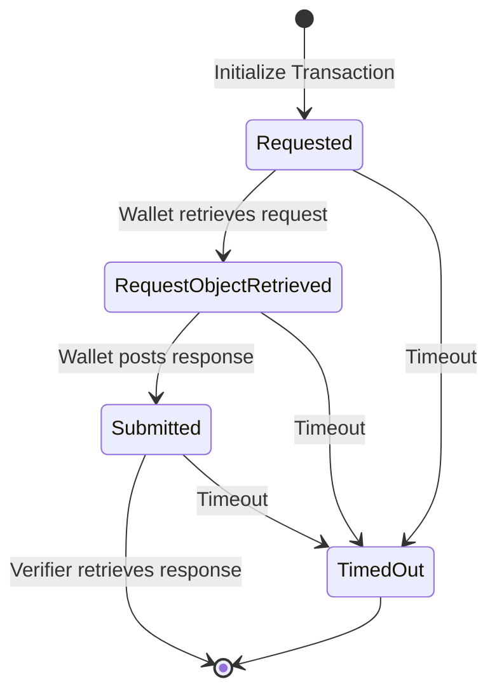

A **Transaction** (also called a **Presentation**) is the core concept in the EUDI Verifier Endpoint. It represents the entire process of requesting and receiving credentials from a wallet holder.

## Transaction vs Request ID

Two identifiers are critical to understanding transactions:

### Transaction ID

```kotlin
@JvmInline
value class TransactionId(val value: String)
```

*From [Presentation.kt:25-30](/home/daytona/workspace/source/src/main/kotlin/eu/europa/ec/eudi/verifier/endpoint/domain/Presentation.kt#L25-L30)*

- The **Transaction ID** is assigned when a transaction is initialized
- Used in the [Verifier API](/api-reference/verifier/overview) endpoints
- Returned in the response to the initialize transaction request
- Used by the verifier to retrieve the wallet response

### Request ID

```kotlin
/**
 * This is an identifier of the [Presentation]
 * which is communicated to the wallet as <em>state</em>.
 * As such, it is being used to correlate an authorization response
 * send from wallet with a [Presentation]
 */
@JvmInline
value class RequestId(val value: String)
```

*From [Presentation.kt:32-43](/home/daytona/workspace/source/src/main/kotlin/eu/europa/ec/eudi/verifier/endpoint/domain/Presentation.kt#L32-L43)*

- The **Request ID** is embedded in the authorization request as the `state` claim
- Communicated to the wallet in the authorization request
- Used in the [Wallet API](/api-reference/wallet/overview) endpoints
- Posted back by the wallet along with its response
- Used to correlate the wallet's response with the original request

<Note>
The separation of Transaction ID and Request ID allows the verifier-facing API and wallet-facing API to use different identifiers while maintaining the association between them internally.
</Note>

## Transaction Lifecycle

A transaction progresses through multiple states from initiation to completion:



### Transaction States

#### 1. Requested

```kotlin
class Requested(
    override val id: TransactionId,
    override val initiatedAt: Instant,
    val query: DCQL,
    val transactionData: NonEmptyList<TransactionData>?,
    val requestId: RequestId,
    val requestUriMethod: RequestUriMethod,
    val nonce: Nonce,
    val responseMode: ResponseMode,
    val getWalletResponseMethod: GetWalletResponseMethod,
    val issuerChain: NonEmptyList<X509Certificate>?,
) : Presentation
```

*From [Presentation.kt:118-129](/home/daytona/workspace/source/src/main/kotlin/eu/europa/ec/eudi/verifier/endpoint/domain/Presentation.kt#L118-L129)*

**Description**: The initial state after a transaction is initialized. The authorization request has been created but not yet retrieved by the wallet.

**Properties**:
- Contains the DCQL query specifying what credentials are requested
- Includes the request ID that will be sent to the wallet as `state`
- Defines the response mode (DirectPost or DirectPostJwt)
- May include optional issuer certificate chain for per-transaction trust

**Transitions**:
- → `RequestObjectRetrieved` when wallet retrieves the authorization request
- → `TimedOut` if the wallet doesn't retrieve the request within the configured timeout

#### 2. RequestObjectRetrieved

```kotlin
class RequestObjectRetrieved private constructor(
    override val id: TransactionId,
    override val initiatedAt: Instant,
    val query: DCQL,
    val transactionData: NonEmptyList<TransactionData>?,
    val requestId: RequestId,
    val requestObjectRetrievedAt: Instant,
    val nonce: Nonce,
    val responseMode: ResponseMode,
    val getWalletResponseMethod: GetWalletResponseMethod,
    val issuerChain: NonEmptyList<X509Certificate>?,
) : Presentation
```

*From [Presentation.kt:137-148](/home/daytona/workspace/source/src/main/kotlin/eu/europa/ec/eudi/verifier/endpoint/domain/Presentation.kt#L137-L148)*

**Description**: The wallet has retrieved the authorization request object (either by value or via `request_uri`).

**Properties**:
- Records the timestamp when the request object was retrieved
- Maintains all properties from the Requested state

**Transitions**:
- → `Submitted` when the wallet posts its response
- → `TimedOut` if the wallet doesn't respond within the configured timeout

#### 3. Submitted

```kotlin
class Submitted private constructor(
    override val id: TransactionId,
    override val initiatedAt: Instant,
    val requestId: RequestId,
    var requestObjectRetrievedAt: Instant,
    var submittedAt: Instant,
    val walletResponse: WalletResponse,
    val nonce: Nonce,
    val responseCode: ResponseCode?,
) : Presentation
```

*From [Presentation.kt:175-184](/home/daytona/workspace/source/src/main/kotlin/eu/europa/ec/eudi/verifier/endpoint/domain/Presentation.kt#L175-L184)*

**Description**: The wallet has posted its response to the verifier endpoint.

**Properties**:
- Contains the complete `walletResponse` (either credentials or an error)
- Records the submission timestamp
- May include a `responseCode` for same-device flows

**Transitions**:
- Transaction can be retrieved by the verifier
- → `TimedOut` if not retrieved within configured retention period

#### 4. TimedOut

```kotlin
class TimedOut private constructor(
    override val id: TransactionId,
    override val initiatedAt: Instant,
    val requestObjectRetrievedAt: Instant? = null,
    val submittedAt: Instant? = null,
    val timedOutAt: Instant,
) : Presentation
```

*From [Presentation.kt:213-219](/home/daytona/workspace/source/src/main/kotlin/eu/europa/ec/eudi/verifier/endpoint/domain/Presentation.kt#L213-L219)*

**Description**: The transaction exceeded its maximum age without completion.

**Properties**:
- Records when the timeout occurred
- Optionally records when request object retrieval or submission occurred

**Transitions**:
- Terminal state, no further transitions

## State Transition Functions

The codebase uses functional state transitions:

```kotlin
fun Presentation.Requested.retrieveRequestObject(clock: Clock): 
    Either<Throwable, Presentation.RequestObjectRetrieved> =
    Presentation.RequestObjectRetrieved.requestObjectRetrieved(this, clock.instant())

fun Presentation.RequestObjectRetrieved.submit(
    clock: Clock,
    walletResponse: WalletResponse,
    responseCode: ResponseCode?,
): Either<Throwable, Presentation.Submitted> =
    Presentation.Submitted.submitted(this, clock.instant(), walletResponse, responseCode)
```

*From [Presentation.kt:261-275](/home/daytona/workspace/source/src/main/kotlin/eu/europa/ec/eudi/verifier/endpoint/domain/Presentation.kt#L261-L275)*

Each transition returns an `Either` type allowing for safe error handling.

## Transaction Events

Each state transition and significant action generates an event:

```kotlin
sealed interface PresentationEvent {
    val transactionId: TransactionId
    val timestamp: Instant

    data class TransactionInitialized(...) : PresentationEvent
    data class RequestObjectRetrieved(...) : PresentationEvent
    data class WalletResponsePosted(...) : PresentationEvent
    data class VerifierGotWalletResponse(...) : PresentationEvent
    data class PresentationExpired(...) : PresentationEvent
    // ... and more
}
```

*From [PresentationEvent.kt:27-97](/home/daytona/workspace/source/src/main/kotlin/eu/europa/ec/eudi/verifier/endpoint/port/out/persistence/PresentationEvent.kt#L27-L97)*

These events can be retrieved via the [Get Presentation Events](/api-reference/verifier/get-events) endpoint for auditing and debugging.

## Configuration

Transaction lifecycle timing is controlled by configuration:

- `VERIFIER_MAXAGE` - TTL of an authorization request (default: `PT6400M`)
- `VERIFIER_PRESENTATIONS_CLEANUP_MAXAGE` - Age after which old transactions are deleted (default: `P10D`)

See the [Environment Variables](/configuration/environment-variables) guide for details.

## Code Examples

### Initializing a Transaction

```bash
curl -X POST http://localhost:8080/ui/presentations \
  -H "Content-Type: application/json" \
  -d '{
    "dcql_query": {
      "credentials": [{
        "id": "32f54163-7166-48f1-93d8-ff217bdb0653",
        "format": "mso_mdoc",
        "meta": { "doctype_value": "eu.europa.ec.eudi.pid.1" },
        "claims": [{ "path": ["eu.europa.ec.eudi.pid.1", "family_name"] }]
      }],
      "credential_sets": [{
        "options": [["32f54163-7166-48f1-93d8-ff217bdb0653"]],
        "purpose": "We need to verify your identity"
      }]
    },
    "nonce": "unique-nonce",
    "jar_mode": "by_reference"
  }'
```

**Response**:
```json
{
  "transaction_id": "STMMbidoCQTtyk9id5IcoL8CqdC8rxgks5FF8cqqUrHvw0IL3AaIHGnwxvrvcEyUJ6uUPNdoBQDa7yCqpjtKaw",
  "client_id": "x509_san_dns:localhost",
  "request_uri": "https://localhost:8080/wallet/request.jwt/5N6E7VZs...",
  "request_uri_method": "post"
}
```

### Retrieving a Transaction

```bash
curl http://localhost:8080/ui/presentations/{transaction_id}?response_code={response_code}
```

## Related API Endpoints

- [Initialize Transaction](/api-reference/verifier/init-transaction) - Create a new transaction
- [Get Wallet Response](/api-reference/verifier/get-wallet-response) - Retrieve the wallet's response
- [Get Presentation Events](/api-reference/verifier/get-events) - View transaction event log
- [Post Wallet Response](/api-reference/wallet/post-response) - Wallet submits response

## Next Steps

- Learn about [Presentation Flows](/concepts/presentation-flows) for same-device and cross-device patterns
- Explore [Trust Sources](/concepts/trust-sources) for credential validation
- Review the [DCQL Query Format](/guides/dcql-queries) for requesting credentials